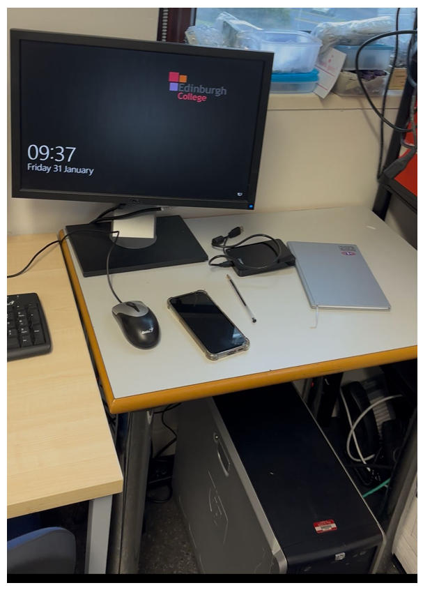
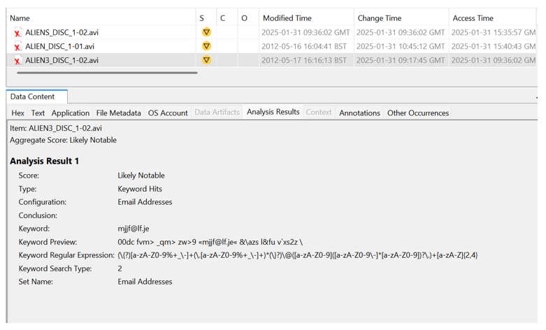

<h1><a href="https://github.com/prsilvaa"> Digital Forensic Investigation</a> </h1>

<h2>Project Objective</h2>

Investigate suspected copyright infringement by applying standard digital forensic procedures. Secure and document all evidence properly to support potential legal actions and protect the company from further risks.

<h2>Tools Used</h2>
<ul>
    <li><strong>Logicube Write Blocker</strong> – Ensures evidence devices are accessed in read-only mode to prevent data modification.</li>
    <li><strong>FTK Imager</strong> – Creates bit-for-bit images of storage devices without altering data.</li>
    <li><strong>Autopsy</strong> – Analyzes file metadata, download history, and sources of pirated content on storage devices.</li>
</ul>

<h2>Skills Gained</h2>
<ul>
    <li>Evidence handling</li>
    <li>Scene securing</li>
    <li>Device analysis</li>
    <li>Reporting procedures</li>
    <li>Investigation planning</li>
</ul>

<h2>Outcome</h2>

Unauthorized file sharing was confirmed through detailed analysis of the USB drive contents and email records. All relevant evidence was carefully collected, documented, and the crime scene was secured to ensure its integrity for further legal investigation and potential court proceedings.

    <h3>Crime Scene - Server Room</h3>
    
    
Secured server room with locked PC and collected evidence.

    <h3>Copyrighted Movies</h3>
    
    
Full-length movies downloaded without permission.

    <h3>Full Music Album - Artist Cover</h3>
    
    
Entire album illegally downloaded and shared.

